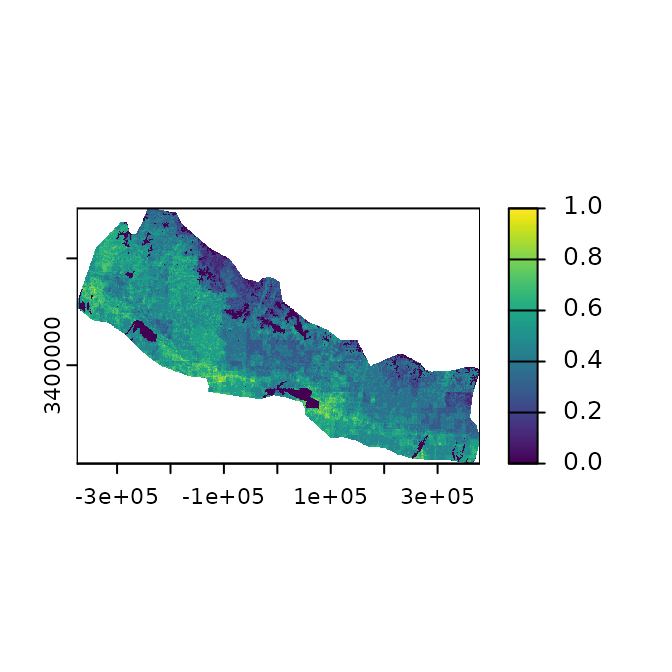
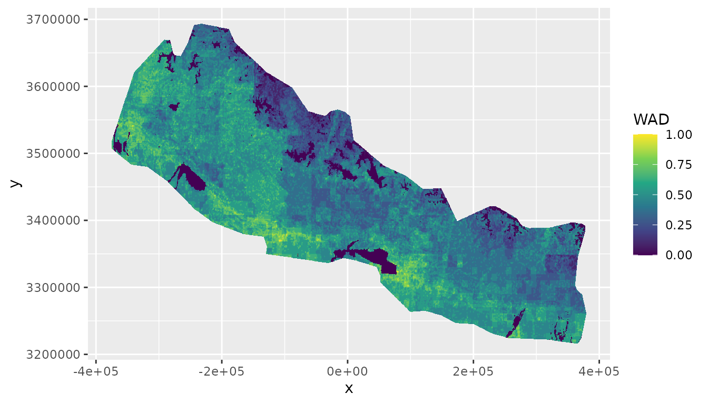
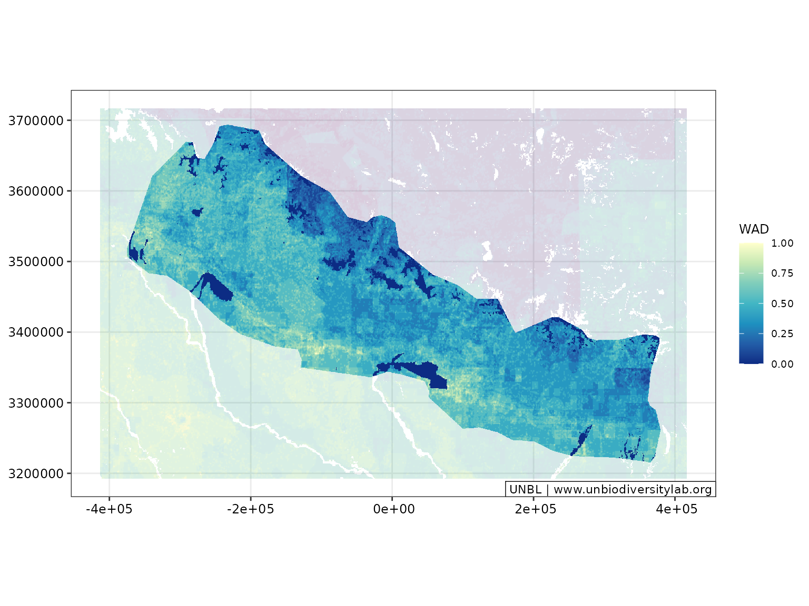
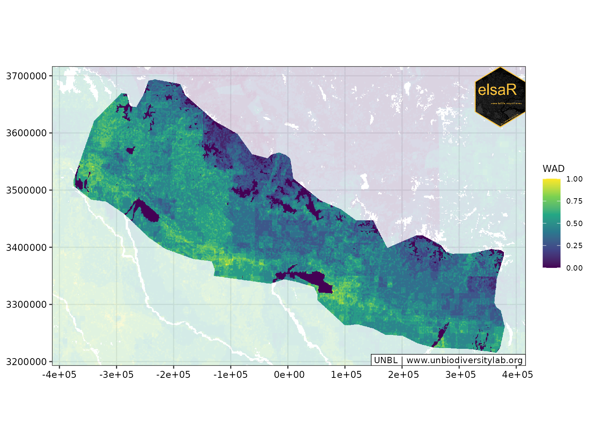

# An Example ELSA Workflow

## Overview

### Introduction

### Get started

``` r
# load packages
library(elsar)
library(prioritizr)
library(dplyr)
library(ggplot2)
library(sf)
library(terra)

# set seed for reproducibility
set.seed(500)
```

### Planning Region

At the start of the analysis, the planning region needs to be defined
and planning units need to be created for the planning region. In this
example, we use Nepal as our case study to demonstrate the functions
within this package.

For this, we first obtain the country boundary of Nepal by using its
iso3 string (“NPL”). Normally, you would need to provide your own data
set with country boundaries to filter from. Data can be loaded from
local machines in vector or raster format, or using a remote connection
via postgres using the
[`elsar_load_data()`](https://elsa-undp.github.io/elsar/reference/elsar_load_data.md)
function. Here, we use a pre-saved dataset.

``` r
# create boundary for Nepal
boundary <- make_boundary(
  boundary_in = boundary_dat,
  iso3 = "NPL",
  iso3_column = "iso3cd",
  custom_projection = FALSE
)

ggplot() +
  geom_sf(data = boundary)
```


The
[`make_boundary()`](https://elsa-undp.github.io/elsar/reference/make_boundary.md)
function also provides the option to create a custom projection centred
on the planning region. This can also be done in separate steps using
the
[`make_custom_projection()`](https://elsa-undp.github.io/elsar/reference/make_custom_projection.md)
function, which is integrated in the
[`make_boundary()`](https://elsa-undp.github.io/elsar/reference/make_boundary.md)
function.

``` r
boundary_proj <- make_boundary(
  boundary_in = boundary_dat,
  iso3 = "NPL",
  iso3_column = "iso3cd",
  custom_projection = TRUE
)

# create custom projection and apply it to boundary
wkt <- make_custom_projection(boundary = boundary, iso3 = "NPL")
boundary_proj2 <- sf::st_transform(boundary, crs = sf::st_crs(wkt))
```

We can test whether the two crs of the boundaries match.

``` r
# test crs
print(sf::st_crs(boundary_proj) == sf::st_crs(boundary_proj2))
#> [1] TRUE
```

### Planning Units

For defining a conservation planning problem, we need to subdivide the
planning region into smaller planning units which can either be selected
or not in the downstream prioritization and which the feature
information can be attributed to. The function has an option to add a
desired planning unit size. If none is provided, the function aims to
make planning units as small as possible whilst still being
computationally efficient. The default for this is set to 850,000
planning units, which is based on previous experience with run time.

``` r
# make planning units
pus <- make_planning_units(
  boundary_proj = boundary_proj,
  pu_size = NULL,
  pu_threshold = 8.5e5,
  limit_to_mainland = FALSE
)
#> [2025-11-28 06:06] pu_size not provided: estimating size to target <= 850000 PUs (allowing 5% tolerance).
#> [2025-11-28 06:06] Iteration 1: 741036 PUs at resolution 450 m
#> [2025-11-28 06:06] Iteration 2: 830662 PUs at resolution 425 m
#> [2025-11-28 06:06] Iteration 3: 937494 PUs at resolution 400 m
#> [2025-11-28 06:06] Exceeded soft threshold (892500); using best previous result.
#> [2025-11-28 06:06] Final PU layer: 830662 PUs at 425 m resolution.
```

### Features

Biodiversity features are an integral part of conservation planning.
Features can range from species distributions, to more general
over-arching datasets such as Key Biodiversity Areas (ref). In our
example, we will use only one dataset, the World Atlas of
Desertification’s (WAD; see <https://wad.jrc.ec.europa.eu/>)
*Convergence of Global Change Issues* dataset. Again, input data can
first be loaded using the
[`elsar_load_data()`](https://elsa-undp.github.io/elsar/reference/elsar_load_data.md)
function (here we have the dataset already saved in the package; change
later).

``` r
# get feature data
wad_subset <- get_wad_data()
```

The data then needs to be re-projected and re-sampled to exactly match
the resolution and extent of the previously created planning units. We
also normalise the data to only have values within the range 0-1.

``` r
# crop and normalise data
wadOut <- make_normalised_raster(
  raster_in = wad_subset,
  pus = pus,
  iso3 = "NPL"
)

terra::plot(wadOut)
```



Instead of only having a quick look at the data by using the `terra`
package’s `plot` function, we can also create a plot using the plotting
options integrated in the `elsar` package, such as
[`elsar_plot_static_raster_c()`](https://elsa-undp.github.io/elsar/reference/elsar_plot_static_raster_c.md),
which allows to plot continuous raster data with `ggplot`.

``` r
(plot_wad <- elsar_plot_static_raster_c(
  raster_in = wadOut, type = "ggplot_raster",
  legend_title = "WAD"
))
```



We can also add background data to the plot and add additional
properties to change the appearance of the plot by using the
[`elsar_plot_optics()`](https://elsa-undp.github.io/elsar/reference/elsar_plot_optics.md)
function that allows to specify a specifc `ggplot` them. We can also
change the colour palette to be something other than the default
“viridis”.

``` r
custom_p <- ggplot2::scale_fill_distiller(
  name = "WAD",
  palette = "YlGnBu",
  aesthetics = c("fill"),
  oob = scales::squish
)

(plot_wad <- elsar_plot_static_raster_c(
  raster_in = wadOut, type = "ggplot_raster",
  custom_palette = custom_p,
  background = wad_subset
) +
  elsar_plot_optics())
#> Adding background layer.
#> Extend based on ratio.
```



If needed, logos can be included on the map. The location is dependent
on the plot dimensions and therefore needs to be adjusted based on the
figure, for example by using
[`terra::ext()`](https://rspatial.github.io/terra/reference/ext.html).

``` r
#topRight
x_min <- terra::ext(wadOut)[1][[1]]
x_max <- terra::ext(wadOut)[2][[1]]
y_min <- terra::ext(wadOut)[3][[1]]
y_max <- terra::ext(wadOut)[4][[1]]

img_xmax <- x_max + x_max * 0.09
img_xmin <- img_xmax * 0.8
img_ymax <- y_max + y_max * 0.102
img_ymin <- img_ymax * 0.8

img_pos <- c(img_xmin, img_xmax, img_ymin, img_ymax)

(plot_out <- elsar_plot_static_raster_c(
  raster_in = wadOut, type = "ggplot_raster",
  background = wad_subset,
  legend_title = "WAD", 
  expand_plot = TRUE
) +
  elsar_plot_optics(include_logo = TRUE, 
                      logo_path = "figures/elsaR_hex_sticker.png", #change to logo later
                      logo_pos = img_pos, 
                      logo_dim = c(50, 60)))
#> Adding background layer.
#> Extend based on ratio.
```



If we are interested in the distribution, we can also plot the
distribution on the plots. For this, we need to create two separate
plots that we then put together:

We can also transform the data into categories and plot the main plot
and the inset that way.

### Existing Protected Area

ADD TEXT LATER

``` r
current_pas <- current_pas_sf

(plot_wad_pas <- elsar_plot_static_raster_c(
  raster_in = wadOut, type = "ggplot_raster",
  background = wad_subset,
  legend_title = "WAD"
) +
  elsar_plot_extra_data(include_pas = current_pas, color_pa = "red") +
  elsar_plot_optics())
#> Adding background layer.
#> Extend based on ratio.
#> Adding PA layer.
#> Coordinate system already present.
#> ℹ Adding new coordinate system, which will replace the existing one.
```


``` r
(plot_wad_pas2 <- elsar_plot_static_raster_c(
  raster_in = wadOut, type = "ggplot_raster",
  background = wad_subset,
  legend_title = "WAD"
) +
  elsar_plot_extra_data(include_pas = current_pas, pas_look = "area", color_pa = "grey") +
  elsar_plot_optics(include_north_scale = TRUE))
#> Adding background layer.
#> Extend based on ratio.
#> Adding PA layer.
#> Coordinate system already present.
#> ℹ Adding new coordinate system, which will replace the existing one.
```


